<div align="center">
  <br>
  
  <h1 align="center">🎵 Moidify</h1>
  <p align="center">
    <strong>Your music. Anywhere. No strings attached.</strong>
    <br>
    A self-hosted music server that streams your collection to any browser.
    <br>
    Drop files. Listen instantly. No accounts required. No algorithms. No ads.
    <br>
    <strong>🔒 No telemetry. No tracking. Everything stays yours.</strong>
  </p>
  <p align="center">
    <a href="#-quick-install">🚀 Quick Install</a>
    ·
    <a href="#-features">✨ Features</a>
    ·
    <a href="#-commands">⚙️ Commands</a>
    ·
    <a href="#-configuration">🔧 Configuration</a>
    ·
    <a href="#-development">🛠️ Development</a>
  </p>
  <p align="center">
    
    
    
    
  </p>
  <br>
</div>

---

## ✨ Features

<table>
<tr>
<td width="50%">

**🎧 Streaming** — MP3, FLAC, OGG, M4A, WAV — everything just works

**🪟 Pop-out Mini Player** — detach playback into a separate always-on-top window (desktop only; mobile uses the persistent bottom bar)

**🔍 Full-text Search** — search tracks, albums, artists with diacritics support (`Beyonce` → `Beyoncé`)

**📂 Browse by Album / Artist / Genre** — grid or list view with cover art

**📋 Sortable Columns** — click any column header to sort A–Z, Z–A, or by duration

**📝 Playlists** — create, pin, reorder by drag-and-drop

</td>
<td width="50%">

**🎛️ 10-Band Equalizer** — presets included (Rock, Jazz, Dance, Classical…)

**📜 Lyrics** — auto-fetched from LRCLIB, synced scrolling

**⏱️ Sleep Timer** — stop after this track, end of queue, or in X minutes

**🔀 Smart Queue** — crossfade, shuffle, repeat (all/one/off)

**💾 Session Persistence** — close or reload the tab and pick up exactly where you left off (position, queue, shuffle mode all saved)

**💿 Vinyl Animation** — spinning disc with CD hole effect on the queue cover art (toggle in settings)

**🛡️ Admin Dashboard** — rescan library, manage users, view play stats, upload files via drag-and-drop

**📥 YouTube / SoundCloud Import** — download any audio URL via the admin panel or `moidify download <url>` CLI command (uses yt-dlp, converts to 192kbps MP3)

**📤 Configurable Upload Limit** — default 2.5 GB, changeable via config file, env var (`MOIDIFY_MAX_UPLOAD_SIZE`), or browser setup wizard

**🔧 Setup Wizard** — first-run wizard at `/setup` creates admin account and guides configuration

**🐳 Docker Support** — Dockerfile + docker-compose.yml for containerized deployment

**🔗 Shareable Playlists** — generate a public link anyone can open and listen to (no account needed)

**📻 On-the-fly Transcoding** — serve medium (256k), low (128k), or voice (64k Opus) streams via ffmpeg

**🏠 Personalized Home Feed** — recently played, top listened, and randomly recommended tracks on login

**🔌 Subsonic API Compatible** — works with clients like Sonixd, Sublime Music, and DSub (`/rest/getArtists`, `/rest/getAlbum`, `/rest/stream`, scrobbling, star/unstar, and more)

**🎮 Discord Rich Presence** — companion script shows your currently playing track on Discord

**📱 Responsive** — works on desktop and mobile browsers

**🎚️ Track Rating** — rate songs 1-5 stars from the track list or context menu

**🔒 No Telemetry** — zero tracking, zero external calls (except optional LRCLIB for lyrics), everything stays on your server

**👤 Dedicated System User** — runs as `moidify` user, not root; isolated and sandboxed by design

**🔐 Optional Auth** — anonymous browsing by default, opt-in user accounts with admin roles; no sign-up wall

</td>
</tr>
</table>

---

## 🚀 Quick Install

One line, works on any Linux distro with systemd:

```bash
curl -sSL https://raw.githubusercontent.com/Moid-M/moidify/main/install.sh | sudo bash
```

<details>
<summary><b>📦 What the installer does (click to expand)</b></summary>
<br>

| Step | What happens |
|---|---|
| 1 | Detects your distro (`apt`/`dnf`/`pacman`/`zypper`) and installs Python, pip, sqlite3 |
| 2 | Creates a `moidify` system user |
| 3 | Copies the app to `/opt/moidify` |
| 4 | Sets up a Python virtual environment |
| 5 | Installs Python dependencies (FastAPI, uvicorn, mutagen, watchdog) |
| 6 | **Asks for max upload size** (default **2.5 GB**) |
| 7 | **Asks for port number** (default **8000**) |
| 8 | **Asks for your music folder location** |
| 9 | **Asks to create an admin account** (optional — skip to use the browser setup wizard later) |
| 10 | Writes config to `/etc/moidify/config.json` |
| 10 | Installs a systemd service |
| 11 | Starts the server immediately |
</details>
<br>

> [!TIP]
> After installation, open **http://your-server-ip:8000** in any browser. If no admin account exists yet, you'll be guided through the **setup wizard** at `/setup`. Drop music into your folder — files appear automatically.

> [!NOTE]
> **Moidify is built with AI-assisted coding.**  
> Most of the code was written through natural language prompts rather than manual typing.  
> If something feels off, please [open an issue](https://github.com/Moid-M/moidify/issues) — it helps make things better.

---

## 🐳 Docker

```bash
git clone https://github.com/Moid-M/moidify.git
cd moidify
docker compose up -d
```

Then open **http://localhost:8000**. Music goes in `./music`, data in `./data`, covers in `./covers`.

> [!TIP]
> After starting, visit the **setup wizard** at `/setup` to create your admin account.

## 🖥️ Manual Install

For development or non-systemd systems:

```bash
git clone https://github.com/Moid-M/moidify.git
cd moidify
python3 -m venv venv
source venv/bin/activate
pip install -r requirements.txt
python3 server.py
```

Then open **http://localhost:8000**.

---

## ⚙️ Commands

### CLI (`moidify`)

After install, a `moidify` CLI is available globally:

```bash
moidify help          Show this help
moidify start         Start the service
moidify stop          Stop the service
moidify restart       Restart the service
moidify reload        Reload config and rescan library
moidify status        Show service status
moidify enable        Enable service on boot
moidify disable       Disable service on boot
moidify logs          Tail server logs
moidify config        Print current configuration
moidify version       Print version
moidify url           Print server URL
moidify update        Update to latest version
moidify download <url>  Download and import audio from YouTube/SoundCloud/etc
```

### Service management (direct)

| Action | Command |
|---|---|
| ▶️ Start | `sudo systemctl start moidify` |
| ⏹️ Stop | `sudo systemctl stop moidify` |
| 🔄 Restart | `sudo systemctl restart moidify` |
| 📊 Status | `sudo systemctl status moidify` |
| 📜 Logs | `journalctl -u moidify.service -f` |
| 🔄 Update | `sudo /opt/moidify/update.sh` |
| 🗑️ Uninstall | `sudo /opt/moidify/uninstall.sh` |

---

## 🔧 Configuration

Moidify checks three places for settings, in order of priority:

1. **Environment variables** (highest priority)
2. **Config file** at `/etc/moidify/config.json` (installed mode)
3. **Local defaults** (development mode)

### Environment variables

| Variable | Default (dev) | Description |
|---|---|---|
| `MOIDIFY_MUSIC_DIR` | `./music` | Path to your music folder |
| `MOIDIFY_COVERS_DIR` | `./covers` | Cover art cache location |
| `MOIDIFY_DB_PATH` | `./data/music.db` | SQLite database path |
| `MOIDIFY_PORT` | `8000` | Server port (systemd mode uses ExecStart directly) |
| `MOIDIFY_MAX_UPLOAD_SIZE` | `2684354560` (2.5 GB) | Max total upload size in bytes |

### Config file

When installed, settings live in `/etc/moidify/config.json`:

```json
{
  "music_dir": "/path/to/your/music",
  "covers_dir": "/var/lib/moidify/covers",
  "db_path": "/var/lib/moidify/music.db",
  "port": 8000,
  "max_upload_size": 2684354560
}
```

> [!NOTE]
> Change a path and restart with `sudo systemctl restart moidify` — your music collection is re-scanned automatically.

---

## 🎮 Discord Rich Presence

Show what you're listening to on your Discord profile:

```bash
pip install pypresence
python3 contrib/discord-presence.py --url http://your-server:8000
```

The script polls Moidify's `/api/player/now-playing` endpoint and updates your Discord status via RPC. Requires the Discord desktop app running and a Discord Application ID (create one at the [Discord Developer Portal](https://discord.com/developers/applications)).

---

## 🛠️ Development

```bash
git clone https://github.com/Moid-M/moidify.git
cd moidify
python3 -m venv venv
source venv/bin/activate
pip install -r requirements.txt
python3 server.py
```

> [!TIP]
> The server uses **watchdog** to monitor your music folder for changes. Drop new files in and they appear instantly — no rescan button needed.

### Project structure

```
moidify/
├── contrib/
│   └── discord-presence.py   # Discord RPC companion script
├── routes/
│   ├── __init__.py
│   ├── deps.py               # Shared utilities, auth helpers, Pydantic models
│   ├── auth.py               # Register, login, me, setup wizard
│   ├── tracks.py             # Tracks, albums, artists, genres, home, ratings
│   ├── streaming.py          # Transcode, stream, cover art, download album
│   ├── playlists.py          # Playlists CRUD, share, folders, favorites, export
│   ├── admin.py              # Dashboard, stats, users, rescan scheduler
│   └── subsonic.py           # Subsonic API compatibility layer (23 endpoints)
├── Dockerfile                # Container image
├── docker-compose.yml        # Docker orchestration
├── server.py                 # FastAPI app (~80 lines, includes all route modules)
├── scanner.py                # File scanner + metadata extractor
├── database.py               # SQLite schema + migrations + indexes
├── config.py                 # Configuration loader
├── install.sh                # System installer script
├── uninstall.sh              # Cleanup script
├── update.sh                 # Git-pull updater
├── moidify.service           # Systemd unit file
├── requirements.txt          # Python dependencies
├── static/
│   ├── index.html            # Main frontend
│   ├── setup.html            # First-run setup wizard
│   ├── shared.html           # Public shared playlist page
│   ├── admin.html            # Admin dashboard
│   ├── style.css             # @imports all CSS files
│   ├── logo.png              # App logo
│   ├── css/                  # Split CSS by feature
│   │   ├── variables.css     # CSS vars, light mode overrides
│   │   ├── layout.css        # App grid, html/body
│   │   ├── sidebar.css       # Nav, playlists, pinned
│   │   ├── main-content.css  # Album/artist grids, track rows
│   │   ├── player.css        # Player bar, seek, volume
│   │   ├── queue.css         # Queue panel
│   │   ├── modal.css         # Overlay + modal
│   │   ├── settings.css      # Settings layout, toggles, EQ
│   │   ├── context-menu.css  # Right-click menu
│   │   ├── nowplaying.css    # Now-playing overlay
│   │   ├── overlays.css      # Fullscreen art, EQ panel, etc
│   │   ├── animations.css    # All keyframes
│   │   ├── features.css      # Misc feature styles
│   │   ├── mini-player.css   # Mini player
│   │   ├── toast.css         # Toast notifications
│   │   └── responsive.css    # All @media queries
│   └── js/
│       ├── state.js          # App state + utility functions
│       ├── icons.js          # SVG icon library
│       ├── api.js            # API client + auth + favorites + playlists
│       ├── i18n.js           # Internationalization (English/German)
│       ├── player.js         # Audio engine + EQ + transcoding
│       ├── queue.js          # Queue management + shuffle
│       ├── lyrics.js         # Lyrics fetching + synced display
│       ├── animations.js     # Visual effects (vinyl spin, CD hole, glow)
│       ├── app.js            # Event binding + session persistence + init
│       ├── ui/               # Split UI helpers
│       │   ├── toast.js
│       │   ├── modal.js
│       │   ├── settings.js
│       │   ├── context-menu.js
│       │   ├── eq-panel.js
│       │   ├── sleep-timer.js
│       │   └── search.js
│       └── views/            # Split page renderers
│           ├── home.js
│           ├── albums.js
│           ├── artists.js
│           ├── tracks.js
│           ├── playlists.js
│           ├── genres.js
│           ├── search.js
│           └── navigate.js
└── music/                    # Your music goes here (local dev)
```

---

## 📸 Screenshots

> <details>
> <summary><b>🖥️ Desktop (click to expand)</b></summary>
> <br>
> 
> <div align="center">
>   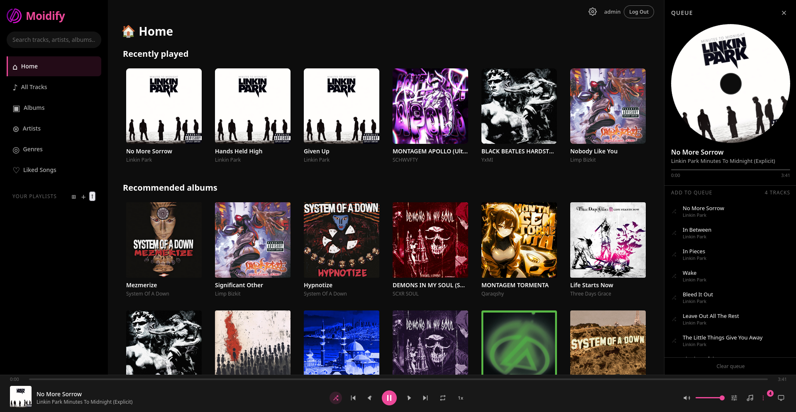
>   <br>
>   <em>Home feed</em>
>   <br><br>
>   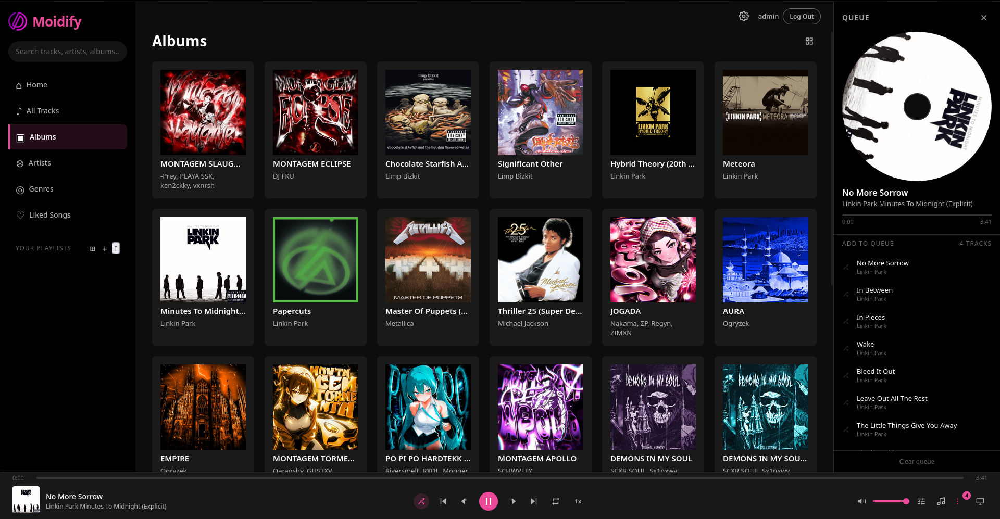
>   <br>
>   <em>Album browser</em>
>   <br><br>
>   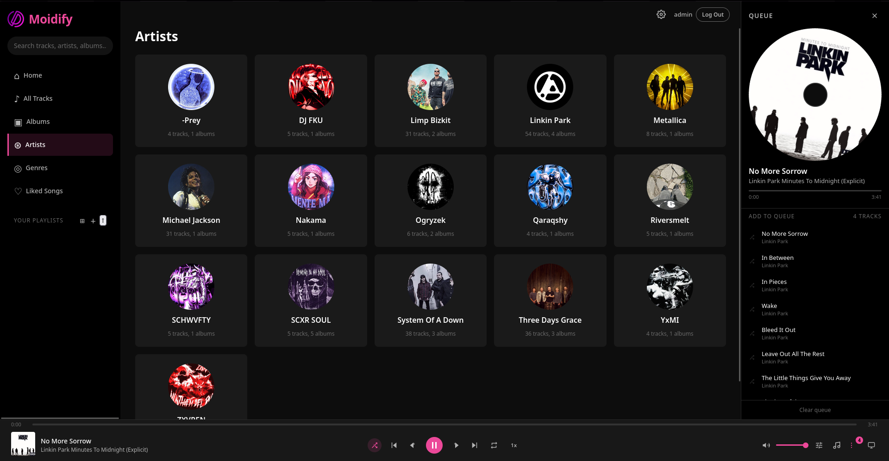
>   <br>
>   <em>Artist grid</em>
>   <br><br>
>   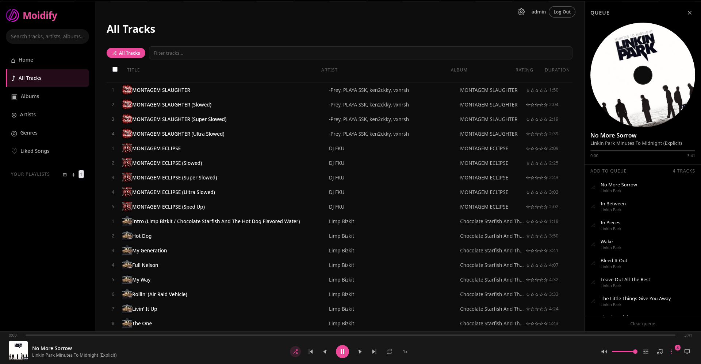
>   <br>
>   <em>Track list with sortable columns</em>
>   <br><br>
>   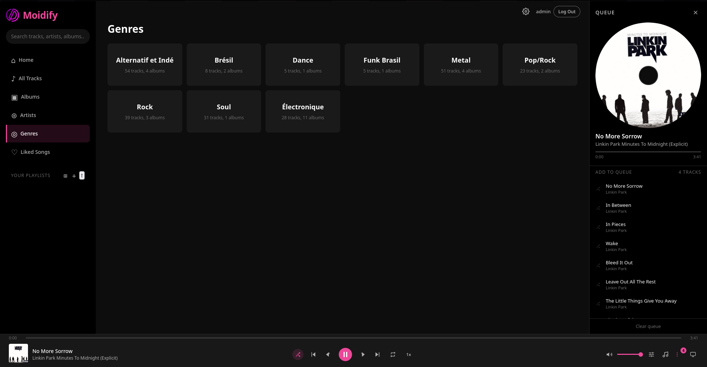
>   <br>
>   <em>Genre browsing</em>
>   <br><br>
>   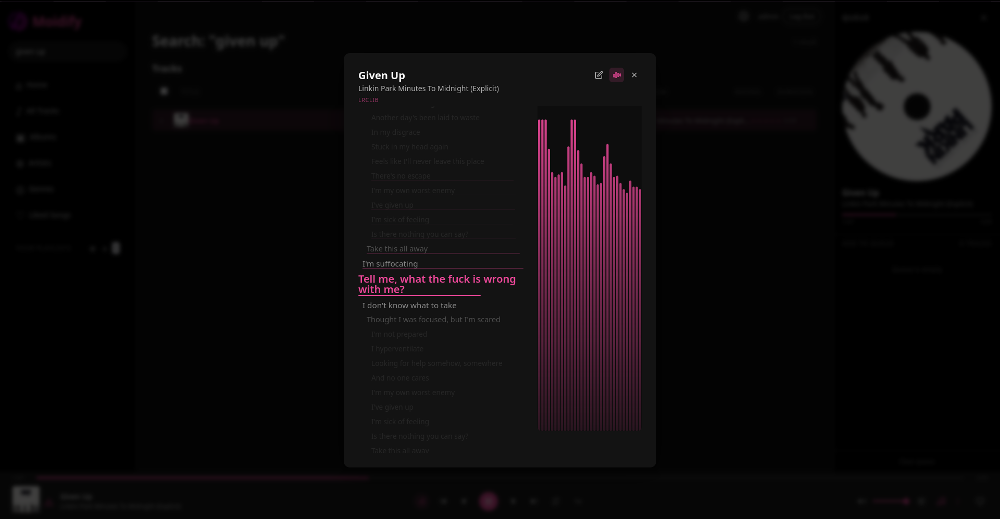
>   <br>
>   <em>Synced lyrics overlay</em>
>   <br><br>
>   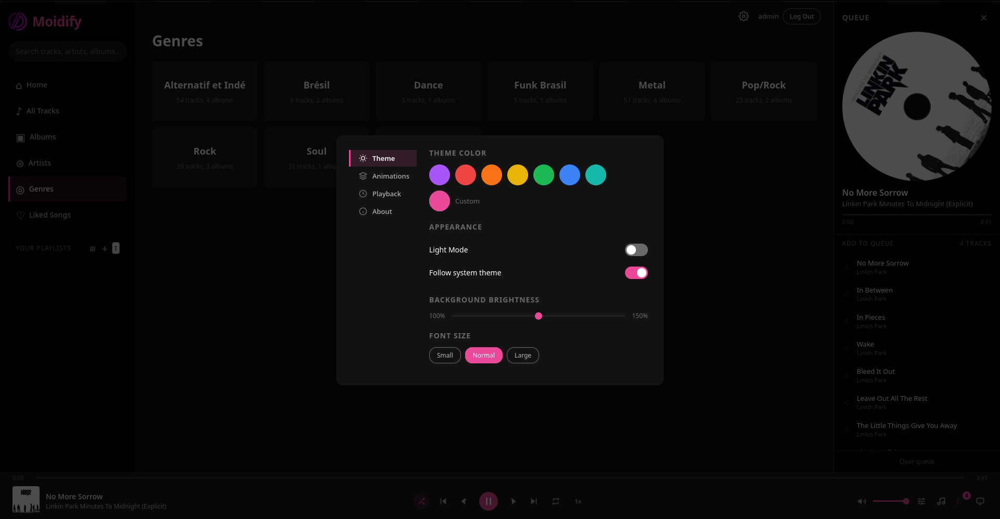
>   <br>
>   <em>Settings modal with equalizer</em>
> </div>
> </details>
> 
> <details>
> <summary><b>📱 Mobile (click to expand)</b></summary>
> <br>
> 
> <div align="center">
>   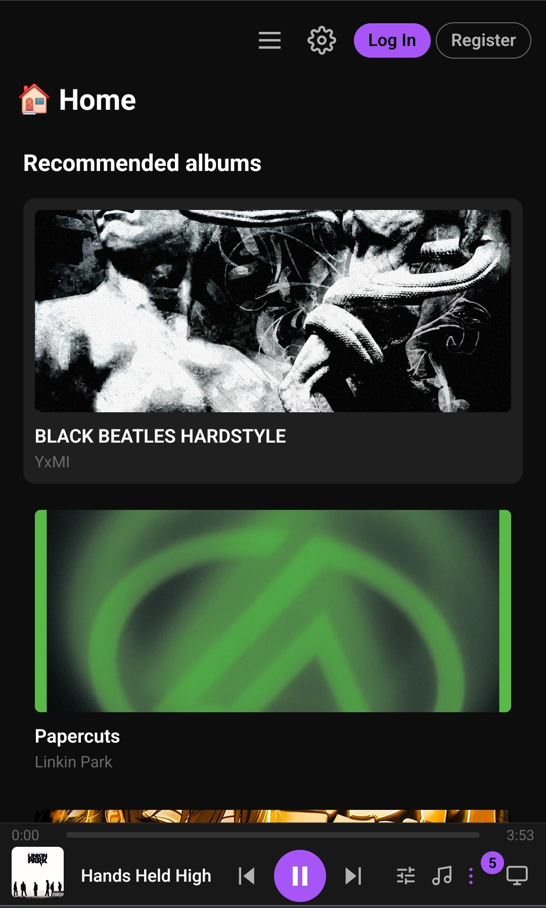
>   <br>
>   <em>Home feed</em>
>   <br><br>
>   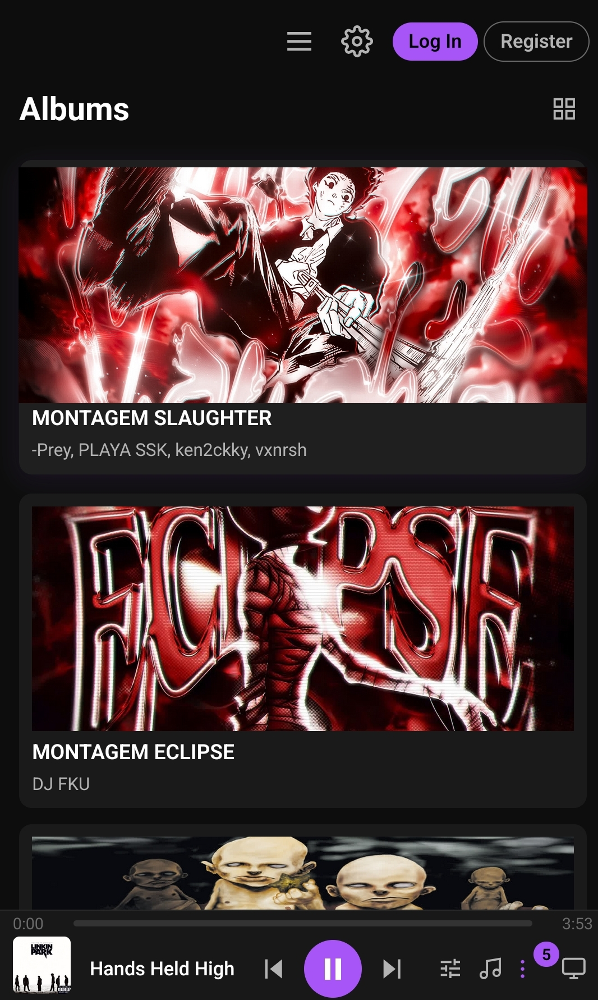
>   <br>
>   <em>Album browser</em>
>   <br><br>
>   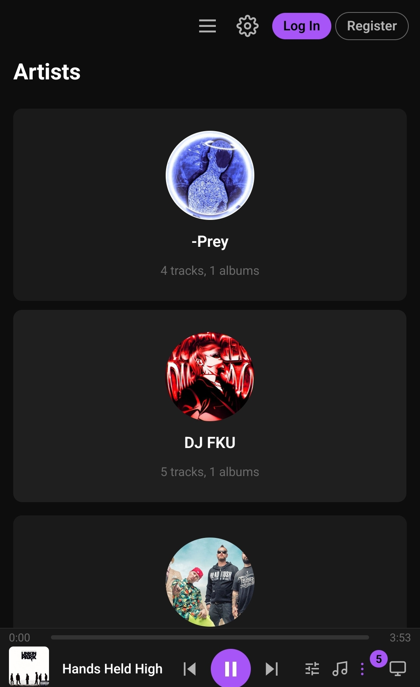
>   <br>
>   <em>Artist grid</em>
>   <br><br>
>   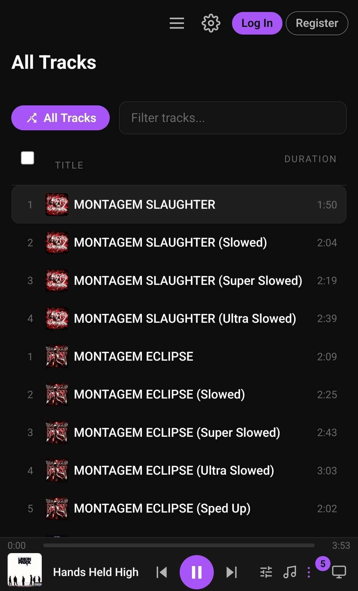
>   <br>
>   <em>Track list</em>
>   <br><br>
>   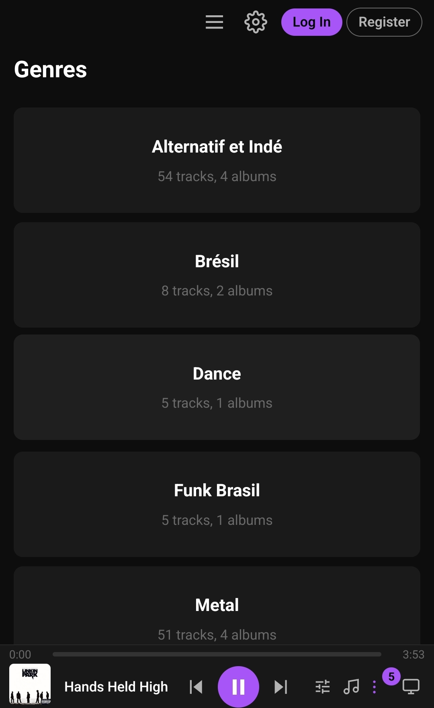
>   <br>
>   <em>Genre browsing</em>
>   <br><br>
>   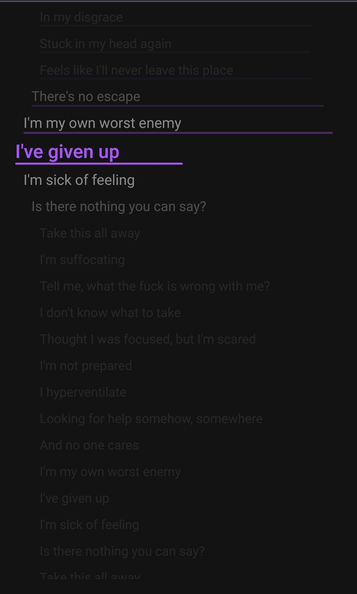
>   <br>
>   <em>Lyrics view</em>
>   <br><br>
>   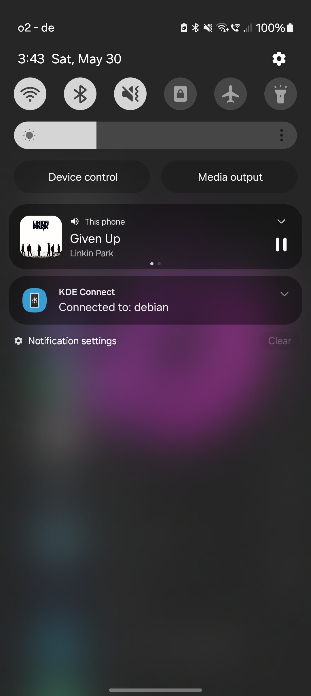
>   <br>
>   <em>Now playing</em>
> </div>
> </details>

---

## 🧩 Tech Stack

| Layer | Technology |
|---|---|
| **Backend** | Python + [FastAPI](https://fastapi.tiangolo.com/) + uvicorn |
| **Frontend** | Vanilla JavaScript (no framework, no build step) |
| **Database** | SQLite (via `sqlite3`) with WAL mode |
| **Metadata** | [Mutagen](https://mutagen.readthedocs.io/) |
| **File watching** | [watchdog](https://github.com/gorakhargosh/watchdog) |
| **Transcoding** | [ffmpeg](https://ffmpeg.org/) — Opus, MP3, FLAC, WAV |
| **Subsonic API** | Built-in `/rest/*` endpoints for third-party clients |

---

## 📄 License

This project is **open source** — you are free to use, modify, share, sell, or do absolutely anything you want with it. No strings attached.

[MIT](LICENSE)

---

<div align="center">
  <p>Made with ❤️ + 🤖 for people who love their music collection.</p>
  <p>
    <a href="https://github.com/Moid-M/moidify/issues">🐛 Report a bug</a>
    ·
    <a href="https://github.com/Moid-M/moidify/issues">💡 Request a feature</a>
  </p>
</div>
